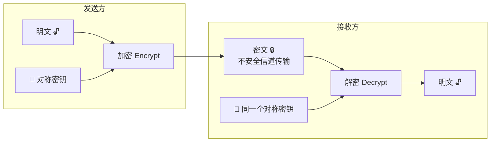

# 对称加密

> 发送方和接收方使用**同一个密钥**进行加密和解密。

---

## 核心特点

- ✅ **速度快**，适合加密大量数据
- ❌ **密钥分发困难**——通信双方怎么安全地拿到同一个密钥？
- **密钥长度越大，安全性越高，但性能越慢**

## 对称加密工作原理

**问题：** 密钥怎么安全地从发方传给收方？（这正是[[非对称加密]]解决的）

---

## 常见算法

| 算法 | 密钥长度 | 状态 | 说明 |
|------|---------|------|------|
| **AES** | 128 / 192 / 256 bit | ✅ 推荐 | 业界标准，硬件加速支持好 |
| **DES** | 56 bit | ❌ 已攻破 | 密钥太短，不再安全 |
| **3DES** | 112 bit | ❌ 逐步淘汰 | 慢且安全性不如 AES |
| **SM4** | 128 bit | ✅ 国密 | 中国国家密码标准 |
| **ChaCha20** | 256 bit | ✅ 推荐 | 移动端/无硬件加速场景优选 |

---

## 工作模式

| 模式 | 说明 | 典型场景 |
|------|------|---------|
| **ECB** | 各块独立加密 | ❌ 不要用！明文模式会泄露模式 |
| **CBC** | 需要 IV，链式加密 | ✅ 文件加密（旧标准） |
| **GCM** | 认证加密（加密 + 完整性校验） | ✅ 当前推荐，TLS 1.3 使用 |
| **CTR** | 将块密码变为流密码 | ✅ 并行加密场景 |

---

## ⚠️ 陷阱：ECB 模式的问题

ECB 模式下，相同明文块产生相同密文块——图像轮廓清晰可见！

**永远不要用 ECB。**

---

## 混合加密（对称 + 非对称）

实际系统用的是混合方案：
1. 用 [[密码学基础/02-非对称加密|非对称加密]] 安全地交换一个**临时对称密钥**
2. 用对称密钥加密后续所有数据

> 这就是 **HTTPS** 的原理：TLS 握手阶段用非对称加密协商对称密钥，之后用对称加密传输数据。

---

## 实践建议

- **优先选 AES-256-GCM**（安全 + 认证加密）
- 移动端或无硬件加速场景用 ChaCha20-Poly1305
- 国内合规场景可能需要 SM4
- IV/Nonce 要随机生成，绝不能重用

#信息安全 #密码学 #对称加密 #概念
