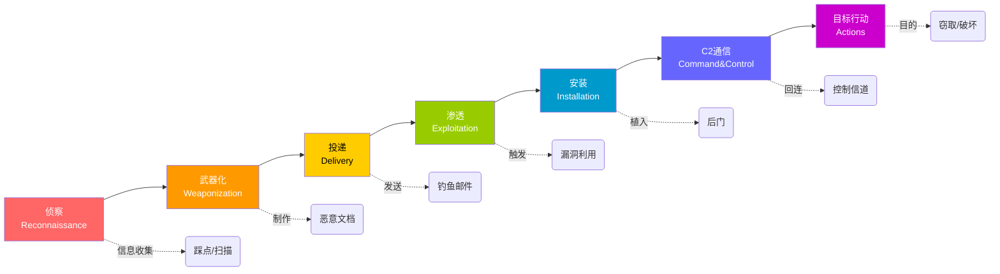

# 网络攻击链（Cyber Kill Chain）

> Lockheed Martin 提出的攻击生命周期模型——知己知彼。

---

## 七阶段模型

---

## 各阶段详解

### 1. 侦察（Reconnaissance）
攻击者收集目标信息。
- **动作**：扫描端口、查 Whois、搜 LinkedIn、Google Dorking
- **工具**：nmap、theHarvester、Shodan
- **防御**：减少暴露面、信息最小化

### 2. 武器化（Weaponization）
将漏洞和 payload 打包为可投递的武器。
- **动作**：制作恶意 Office 文档、捆绑木马、构造 SQL 注入 payload
- **工具**：msfvenom、Veil
- **防御**：端点检测、沙箱分析

### 3. 投递（Delivery）
将武器发送到目标。
- **动作**：钓鱼邮件、USB 摆渡、水坑攻击、供应链注入
- **工具**：钓鱼框架（GoPhish）、恶意二维码
- **防御**：邮件过滤、安全意识培训、DLP

### 4. 渗透/利用（Exploitation）
触发漏洞，获得初始访问权。
- **动作**：浏览器漏洞、PDF 漏洞、宏执行、SQL 注入
- **典型**：CVE 漏洞利用、弱口令爆破
- **防御**：补丁管理、应用白名单、WAF

### 5. 安装（Installation）
在受害者系统上建立持久化。
- **动作**：写启动项、安装服务、注册表持久化、计划任务
- **防御**：EDR、行为检测、文件完整性监控

### 6. C2 通信（Command & Control）
与攻击者的控制服务器建立通信信道。
- **动作**：DNS 隧道、HTTPS 隧道、ICMP 隧道、WebSocket
- **防御**：网络流量分析、威胁情报 IOC 匹配、DNS 监控

### 7. 目标行动（Actions on Objectives）
攻击者完成其最终目的。
- **动作**：
  - 数据窃取（Data Exfiltration）
  - 数据加密（勒索）
  - 系统破坏
  - 横向移动 + 持续控制
- **防御**：DLP、数据访问审计、最小权限

---

## 在 Kill Chain 各阶段拦截

| 阶段 | 拦截手段 |
|------|---------|
| 侦察 | 减少信息暴露、CDN 隐藏真实 IP |
| 武器化 | 附件沙箱扫描、宏禁用 |
| 投递 | 邮件安全网关、URL 过滤 |
| 渗透 | 补丁管理、WAF、EDR |
| 安装 | 端点保护、应用管控 |
| C2 | 网络流量分析、DNS 告警 |
| 目标行动 | DLP、最小权限、备份 |

**越早拦截越好**——等到第7阶段（数据被窃），损失已经造成。

---

## ⚠️ 局限性

1. **不适合内部威胁** — 内部人员不需要侦察和投递阶段
2. **不适合 APT 零日攻击** — 武器化阶段使用的可能是未知漏洞
3. **过于线性** — 现实中攻击者可能会跳跃或重复某些阶段

> 有 MITRE ATT&CK 框架作为补充（[09-威胁情报基础]] 中涉及）。

#网络安全 #攻击链 #概念
