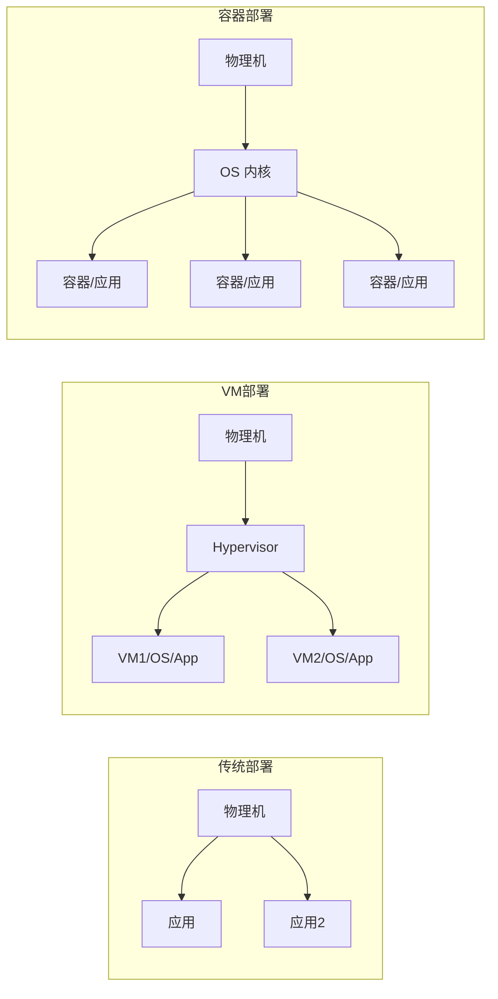

# 容器与 K8s 基础

> 云原生时代的操作系统级虚拟化技术。

---

## 为什么需要容器？



---

## Docker 核心概念

| 概念 | 说明 | 类比 |
|------|------|------|
| **镜像（Image）** | 只读模板，包含运行环境和应用 | 类 / ISO |
| **容器（Container）** | 镜像的运行实例 | 类的实例 |
| **Dockerfile** | 打包镜像的配方文件 | 配方 |
| **镜像仓库** | 存储和分发镜像 | GitHub for Images |
| **Volume** | 数据持久化 | U盘 |

### 常用命令
```bash
docker pull nginx:latest         # 拉取镜像
docker run -d -p 80:80 nginx     # 运行容器
docker ps                         # 查看运行中的容器
docker build -t myapp:1.0 .      # 构建镜像
docker push myrepo/myapp:1.0     # 推送镜像
```

---

## K8s（Kubernetes）核心概念

### 架构

```
Control Plane（控制面）
├── kube-apiserver  ← 所有操作的入口
├── etcd            ← 集群状态存储
├── kube-scheduler  ← 调度 Pod 到哪个节点
└── kube-controller-manager ← 维护期望状态

Worker Node（工作节点）
├── kubelet         ← 确保容器按预期运行
├── kube-proxy      ← 网络代理和负载均衡
└── 容器运行时（如 containerd）
```

### 核心资源对象

| 资源 | 作用 |
|------|------|
| **Pod** | 最小部署单元（一个或多个容器） |
| **Deployment** | 声明式更新 Pod |
| **Service** | 稳定的网络端点，负载均衡 |
| **ConfigMap / Secret** | 配置和敏感信息管理 |
| **Ingress** | 外部 HTTP 访问入口 |

---

## 安全要点

容器≠虚拟机沙箱。容器共享宿主机内核，隔离性天生弱于 VM：

| 风险 | 说明 |
|------|------|
| 镜像漏洞 | 基础镜像可能含有 CVE |
| 逃逸攻击 | 利用内核漏洞逃出容器 |
| 配置不当 | 特权模式、宿主网络 |
| 供应链 | 镜像源被投毒 |

> 详细安全措施见 [[04-云安全/04-云原生安全]]

---

## ⚠️ 坑

1. **Docker 不等于 K8s** — Docker 只是容器运行时，K8s 是更上层的编排
2. **不要用 latest 标签** — 回滚和复现会出问题
3. **镜像做好精简** — 用 Alpine / Distroless 基础镜像减少攻击面
4. **K8s RBAC 不能忽略** — 默认配置权限过大

#云计算 #容器 #K8s #Docker #概念
