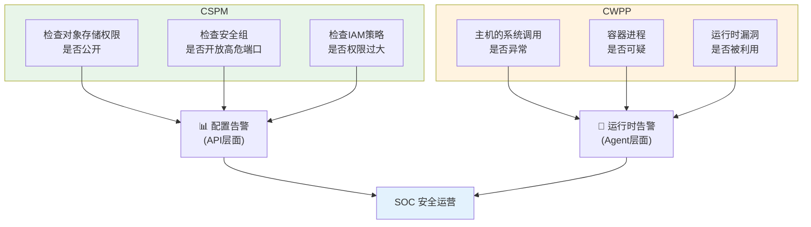

# CSPM 与 CWPP

> 云上安全的两大监控工具：防配置错误 + 防运行时攻击。

---

## CSPM（云安全态势管理）

**关注：配置安全**

### 做什么
- 持续扫描云资源配置，发现错误配置
- CIS Benchmark、等保基线合规检查
- 暴露面识别（公网开放的 RDS、公开的 S3 桶）
- 权限越权检测

### 典型发现
```
❌ OSS Bucket 策略允许公共读写
❌ ECS 安全组对所有 IP 开放 22 端口
❌ RDS 数据库未开启 SSL 加密
❌ RAM 用户长期未使用
```

### 代表工具
| 工具 | 性质 |
|------|------|
| 阿里云 云安全中心 | 云厂商原生 |
| AWS Security Hub | 云厂商原生 |
| Wiz | 第三方（业界领先） |
| Checkov（IaC 扫描） | 开源（扫描 Terraform） |

---

## CWPP（云工作负载保护）

**关注：运行时安全**

### 做什么
- **主机安全** — 漏洞扫描、入侵检测、文件完整性
- **容器安全** — 镜像扫描、运行时行为监控
- **无服务器安全** — Lambda/FaaS 函数扫描

### 典型能力
- 漏洞管理（Agent 扫描主机/镜像 CVEs）
- 入侵检测（文件、进程、网络行为）
- 漏洞基线合规
- 应用白名单

---

## CSPM vs CWPP



## CSPM vs CWPP

| 对比 | CSPM | CWPP |
|------|------|------|
| 关注点 | 配置漂移 | 运行时攻击 |
| 检测面 | API 层（云厂商 API） | 工作负载（Agent/镜像） |
| 覆盖资源 | 云上所有服务的配置 | 计算资源（VM/容器/函数） |
| 告警频率 | 相对低频 | 实时 |
| 修复方式 | 配置修改 | 隔离/补丁/配置 |

---

## 实践建议

- **CSPM 做第一关** — 部署前就用 IaC 扫描拦截配置问题
- **CWPP 做第二关** — 运行时持续监控
- 两者联动：CSPM 发现配置违规 → 生成安全事件 → CWPP 确认是否有实际攻击

#云安全 #CSPM #CWPP #工具
