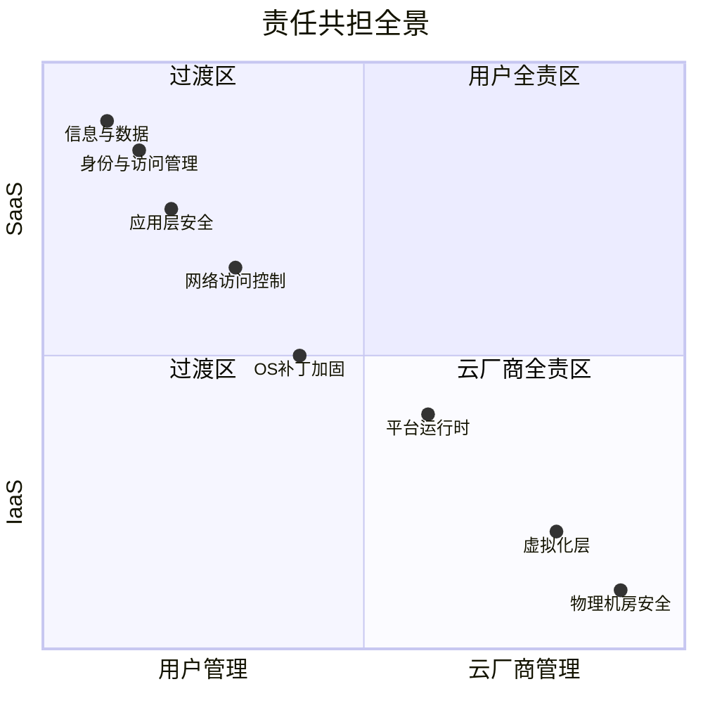
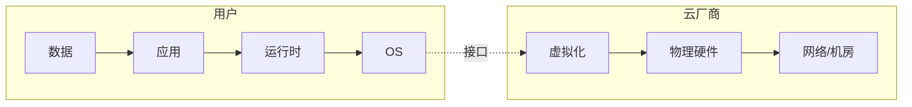

# 云安全责任共担模型

> **你负责你管的部分，云厂商负责它管的部分，边界因服务模式而异。**

---

## 责任矩阵

根据选择的 [[03-云服务与架构/03-IaaS-PaaS-SaaS|服务模式]]，责任边界不同：

**IaaS模式下的责任分割（实线=用户管，虚线=云厂商管）：**

---

## 注意：用户的责任不会消失

上云不意味着"安全不用管了"，而是：

| 传统 IDC | 上云后 |
|---------|--------|
| 自己买硬件防火墙 | 配置云上的安全组 + ACL |
| 自己打 OS 补丁 | IaaS 还是自己打，PaaS 不用管 |
| 自己管理 VPN | 配置云上的 VPN/专线 |
| 自己备份数据 | 配置自动备份策略 |
| 自己监控网络 | 配置云监控 + 日志服务 |

**核心变化：从"自己干活"变成"自己配置好之后让云自动干活"**，但配置还是要你自己来做。

---

## 常见的误解

| 误解 | 真相 |
|------|------|
| "上云了安全就是云厂商的事" | 数据、访问权限、应用安全还是你的责任 |
| "云比我本地安全" | 云基础设施确实更安全，但配置错误的风险也更大 |
| "云有 SLA 所以不会丢数据" | SLA 保证的是可用性，不是你误删后的恢复 |

---

## 实际案例

> 2020 年某知名公司因错误配置 AWS S3 存储桶，导致上亿条用户记录泄露。
> 原因：S3 策略设置为 public，没有启用阻止公共访问。
> **责任方：用户（配置错误），AWS（S3 本身是安全的）。**

---

## 云上安全三问

每次部署资源之前问自己：
1. **谁可以访问这个资源？**（IAM / 安全组）
2. **数据在传输和存储中是否加密？**（TLS / KMS）
3. **有没有日志记录谁做了什么？**（CloudTrail / 操作审计）

#云安全 #责任共担 #概念
