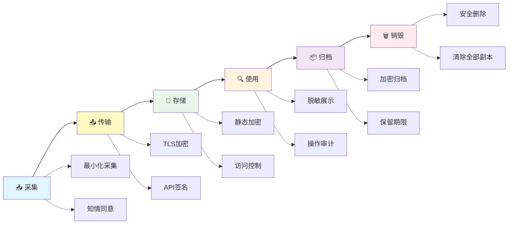

# 数据生命周期管理

> 数据从产生到销毁，每个阶段都需要安全管理。

---

## 六个阶段

---

## 各阶段安全要点

### 1. 数据采集
| 要点 | 说明 |
|------|------|
| **最小化采集** | 只采集业务需要的数据 |
| **知情同意** | 用户知道并同意收集目的 |
| **匿名化优先** | 能匿名就匿名，不要收集可识别个人信息 |
| **采集渠道验证** | 数据来源可信吗？是否是篡改过的数据？ |

### 2. 数据传输
| 要点 | 说明 |
|------|------|
| **TLS 1.2+** | 所有外部通信强制加密 |
| **内部通信也加密** | 即使在 VPC 内，微服务间也使用 mTLS |
| **API 签名** | 使用 HMAC 或 JWT 验证请求来源 |

### 3. 数据存储
| 要点 | 说明 |
|------|------|
| **静态加密** | AES-256 或 SM4 |
| **访问控制** | 最小权限原则 |
| **备份加密** | 备份数据也要加密 |
| **数据分层** | 热数据用高性能存储，冷数据转归档 |

### 4. 数据使用
| 要点 | 说明 |
|------|------|
| **脱敏展示** | 非必要不展示完整敏感字段 |
| **访问审计** | 谁在什么时间看了什么数据 |
| **数据消费** | 数据 API 需要认证和授权 |

### 5. 数据归档
| 要点 | 说明 |
|------|------|
| **分级存储** | 按访问频率切换存储级别 |
| **加密保存** | 存档也需要加密 |
| **保留期限** | 按法规要求设定保留期 |
| **检索可用** | 归档不等于不可用——需要时能找回 |

### 6. 数据销毁
| 要点 | 说明 |
|------|------|
| **安全删除** | 不只是 delete，要覆写或物理销毁 |
| **所有副本** | 备份、缓存、日志中也要清理 |
| **云上销毁** | OSS/S3 对象删除后注意取消跨区域复制 |
| **销毁确认** | 出具销毁证明（尤其合规场景） |

---

## 数据保留策略示例

| 数据类型 | 保留期限 | 存储位置 | 最终处理 |
|---------|---------|---------|---------|
| 用户注册信息 | 用户注销后 30 天删除 | 数据库（加密） | 安全删除 |
| 操作日志 | 180 天（等保要求） | 日志服务 | 归档后删除 |
| 交易记录 | 5-10 年（财务法规） | 归档存储 | 到期安全删除 |
| 实时监控指标 | 30 天 | 时序数据库 | 自动淘汰 |
| 系统备份 | 90 天 | 对象存储（归档） | 到期自动过期 |

---

## ⚠️ 常见问题

1. **数据"只进不出"** — 只有采集没有销毁，数据越积越多
2. **备份忘了加密** — 备份介质丢了就是数据泄露
3. **测试环境使用生产数据** — 必须脱敏再用
4. **日志中包含了敏感数据** — 日志采集前需要做字段过滤

#数据安全 #数据生命周期 #最佳实践
