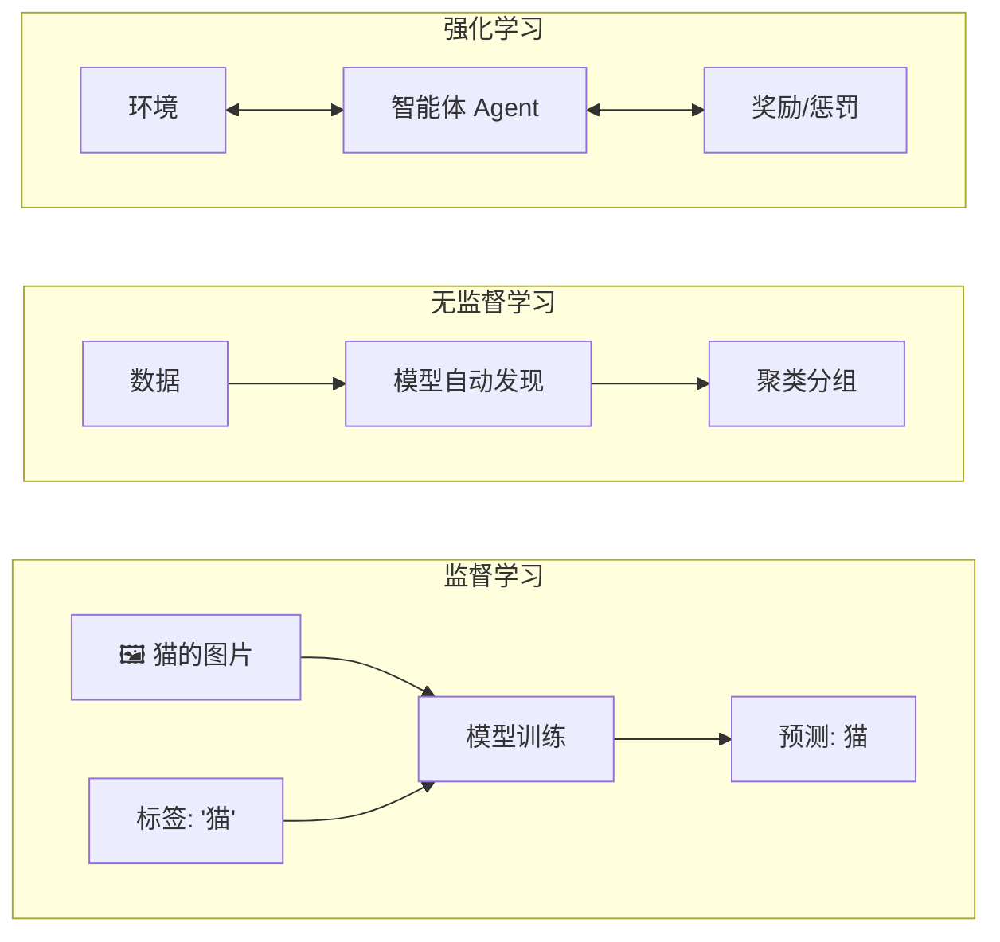

# 机器学习基础

> 让计算机从数据中学习规律，而不是写死规则。

---

## 机器学习三范式



### 1. 监督学习（Supervised Learning）

**数据：** 输入 + 标签
**目标：** 学习输入到标签的映射关系

```
输入：猫咪.jpg → 模型 → 输出："猫"（标签）
```

| 任务类型 | 说明 | 算法举例 |
|---------|------|---------|
| **分类** | 预测类别 | 决策树、SVM、逻辑回归、CNN |
| **回归** | 预测数值 | 线性回归、随机森林回归 |

### 2. 无监督学习（Unsupervised Learning）

**数据：** 只有输入，没有标签
**目标：** 发现数据中的结构/模式

| 任务类型 | 说明 | 算法举例 |
|---------|------|---------|
| **聚类** | 把相似的数据放一起 | K-Means、DBSCAN |
| **降维** | 减少特征数量保留关键信息 | PCA、t-SNE |
| **异常检测** | 找与众不同的数据点 | 孤立森林、AutoEncoder |

### 3. 强化学习（Reinforcement Learning）

**数据：** 通过与环境的交互获得奖励/惩罚
**目标：** 学习最大化累积奖励的策略

| 经典应用 | 说明 |
|---------|------|
| AlphaGo | 自我对弈学习围棋 |
| RLHF | 人类反馈强化学习（训练 LLM 的对齐） |

---

## 基本流程

```
数据收集 → 数据清洗 → 特征工程 → 模型选择 → 训练 → 评估 → 部署 → 监控
                                                                     │
                                                                     └─→ 迭代
```

---

## 关键概念

| 概念 | 说明 |
|------|------|
| **训练集** | 用来训练模型的数据 |
| **验证集** | 用来调参和选择模型 |
| **测试集** | 用来评估最终模型效果（训练期间不可见） |
| **过拟合** | 模型在训练集上很好，测试集上很差 |
| **欠拟合** | 模型连训练集都没学好 |
| **损失函数** | 衡量预测值和真实值差距的函数 |

---

## ⚠️ 安全视角

- **数据投毒** — 攻击者在训练数据中插入恶意样本，操纵模型行为
- **模型窃取** — 通过大量 API 调用反向重建近似模型
- **对抗样本** — 在输入上添加人眼不可见的扰动，让模型错误分类

#AI基础 #机器学习 #概念
