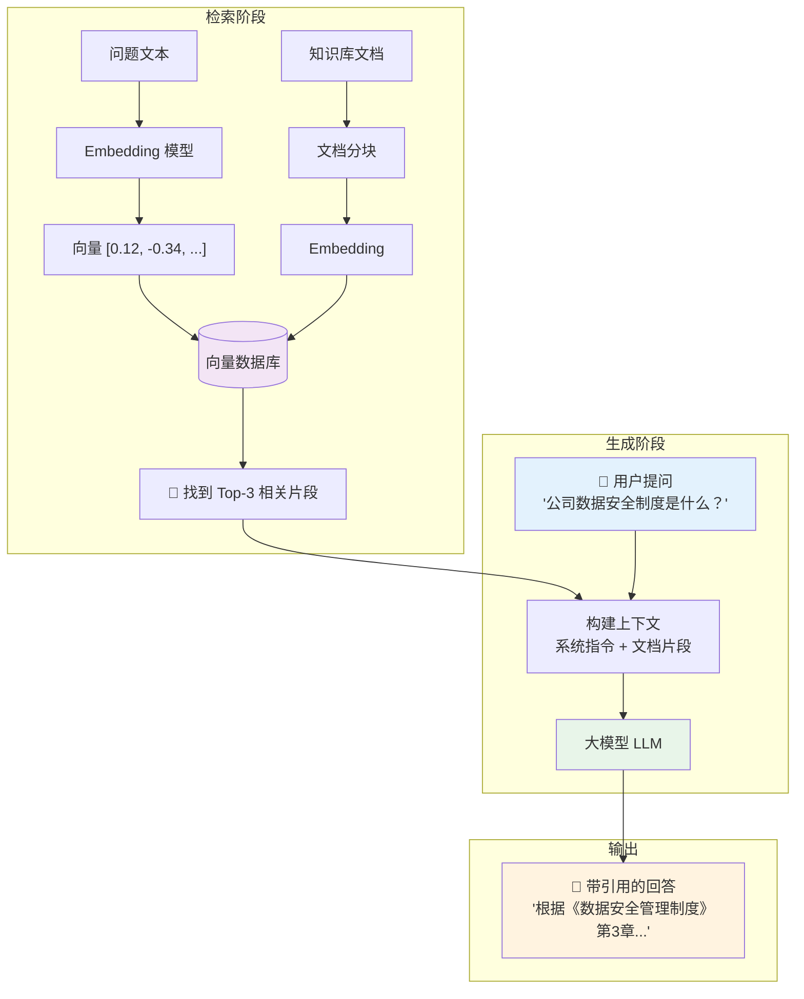

# RAG（检索增强生成）应用开发

> 让 LLM 在回答问题时能"查资料"，而不是空口说白话。

---

## 为什么需要 RAG

LLM 的核心问题：
- **知识有截止日期** - 不知道训练之后发生的事情
- **幻觉** - 不知道的会胡编
- **没有来源引用** - 你不知道它说的对不对

RAG 的解决方案：在回答前先检索相关文档，把上下文作为材料注入 prompt。

---

## RAG 流程图



---

## 技术组件

| 组件 | 可选方案 | 说明 |
|------|---------|------|
| **Embedding 模型** | text-embedding-3-small、BGE、m3e | 将文本转为向量 |
| **向量数据库** | Chroma、Milvus、FAISS、Pinecone | 存储和搜索向量 |
| **文档解析** | Unstructured、LlamaParse | PDF/HTML/文档转文本 |
| **分块策略** | 固定大小、语义分块 | 决定如何切分文档 |
| **检索排序** | 相似度检索 + 重排序 | 把最相关的排在前面 |
| **生成模型** | GPT / Qwen / DeepSeek | 基于上下文回答 |

---

## 进阶增强

| 技术 | 说明 |
|------|------|
| **Hybrid Search** | 向量检索 + 关键词检索（BM25）结合 |
| **Multi-hop RAG** | 多轮检索，先查A再查B |
| **Agentic RAG** | 让 Agent 自己决定什么时候查什么 |
| **Graph RAG** | 基于知识图谱的检索（微软方案） |
| **Self-RAG** | 让模型自己判断是否需要外部检索 |

---

## 简单实现（伪代码）

```python
# 1. 文档入库
for doc in documents:
    chunks = split_text(doc)           # 分块
    for chunk in chunks:
        vector = embed(chunk)           # 向量化
        vector_db.add(chunk, vector)    # 存入向量库

# 2. 查询
query = "公司的数据安全分类标准是什么？"
q_vector = embed(query)
results = vector_db.search(q_vector, k=3)

# 3. 生成
prompt = f"""
基于以下资料回答问题：

【资料】
{concat(results)}

【问题】
{query}
"""
answer = llm(prompt)
```

---

## ⚠️ 陷阱

1. **分块策略不对，上下文丢失** — 分块太小信息不全，太大噪声太多
2. **检索不到 = 模型开始瞎编** — 需要设置"未找到相关文档"的处理逻辑
3. **Embedding 质量不够** — 中文场景要选中文 Embedding 模型
4. **检索到的结果太多** — 不要所有 top-k 都塞进 prompt，设置相关性阈值过滤

#AI工具 #RAG #开发 #概念
