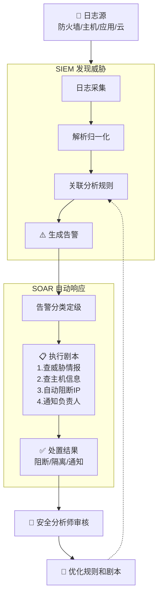

# SIEM 与 SOAR

> SOC 的两大核心平台。

---

## SIEM（安全管理与事件管理）

### 做了什么
1. **日志集中** — 收集网络、主机、应用、云上的日志
2. **关联分析** — 跨日志源的规则关联，发现攻击链
3. **告警生成** — 满足条件时生成安全告警
4. **合规报告** — 输出合规审计所需的日志报告

### 数据管道
```
日志源 → 日志采集 → 解析/归一化 → 索引/存储 → 关联分析 → 告警
                                    ↑
                                 威胁情报 → 关联规则
```

### 代表产品
| 方案 | 类型 |
|------|------|
| Splunk | 商业（最强） |
| Elastic SIEM | 开源版 |
| 阿里云 SLS + 安全告警 | 云原生 |
| Wazuh | 开源免费 |
| 奇安信 NGSOC | 国产 |

---

## SOAR（编排、自动化与响应）

### 做了什么
1. **告警分类** — 自动归类重复告警
2. **剧本执行** — 预定义的自动化响应流程
3. **工单流转** — 和其他系统联动（ITSM、飞书）
4. **知识沉淀** — 案件调查过程记录

### 典型剧本示例
```
告警：检测到可疑外连

Step 1: 查询威胁情报（自动）
  → IP 在已知 C2 名单中？
  → 是 → 继续
  → 否 → 降级为参考信息

Step 2: 核实主机信息（自动）
  → 查询 CMDB 确定主机归属
  → 确定风险等级

Step 3: 自动遏制（按规则）
  → 安全组阻断该 IP 出口流量
  → 在 EDR 上隔离主机

Step 4: 通知（自动）
  → 发送飞书消息：主机XXX可能被攻陷，已执行阻断

Step 5: 等待人工确认（半自动）
  → 安全分析师确认并决定后续措施
```

---

## SIEM + SOAR 协作流程



## SIEM + SOAR = 互补

| 维度 | SIEM | SOAR |
|------|------|------|
| 核心功能 | 发现威胁 | 响应处置 |
| 自动化程度 | 规则匹配 | 剧本编排 |
| 输出 | 告警 | 处置动作 |
| 成功标准 | 不漏报 | 快响应 |

**最佳搭配：SIEM 负责"发现了"，SOAR 负责"搞定了"。**

---

## ⚠️ 陷阱

1. **买 SIEM 之前先想好谁看告警** — 没人看得 SIEM=买了也白买
2. **SOAR 剧本需要持续维护** — 敌人战术变了剧本也得变
3. **日志不全=SIEM 是个瞎子** — 覆盖面不够，关联分析就做不出来
4. **成本不可忽视** — SIEM 的日志存储费用可能很高

#安全运营 #SIEM #SOAR #工具
